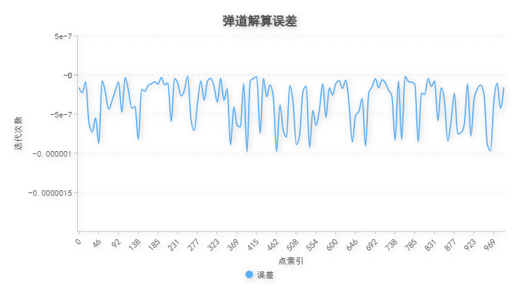
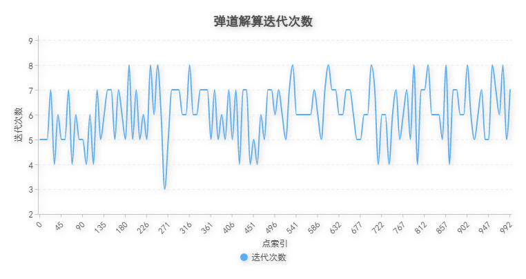

# Trajectory Solution

With classic mechanics theory, equations blew could be given if air resistance ignored.

$$

\left\{\begin{matrix}\\
	\tan \theta = \displaystyle\frac{v_y}{v_x}\\\\
	\begin{pmatrix}
		\sqrt{x^2+y^2} \space\\
		z
	\end{pmatrix}=\displaystyle\int_0^T\begin{pmatrix}
		v_x\\
		v_y - g \ast t
	\end{pmatrix}dt\\\\
	\left|\begin{pmatrix}
		v_x\\
		v_y
	\end{pmatrix}\right|=v_0\\
	\\
\end{matrix}

\right.

$$

Due to its complexity in solving, iterative method is adopted to calculate an approximate solution.  

$$
\left\{\begin{matrix}\\
	s = \sqrt{x^2+y^2} \\
	\\
	z'_{n-1} = s \tan \theta_{n-1}-\displaystyle\frac{gs^2\sec^2\theta_{n-1}}{2v_0^2}\\
	\\
	e_{n-1} = z'_{n-1} - z
	\\
	\\
	\theta_n = \arctan\displaystyle\frac{z'_{n-1} - e_{n-1}}{s}\\
	\\
	\theta_0 = \arctan\displaystyle\frac{z}{s}\\
	\\
\end{matrix}
\right.
$$

Among them, $\displaystyle e_n$ is used to represent the estimation of error.

With the iterative method, the following graphical results could be given, which indicate that the error can converge to 0 within ten iterations.

